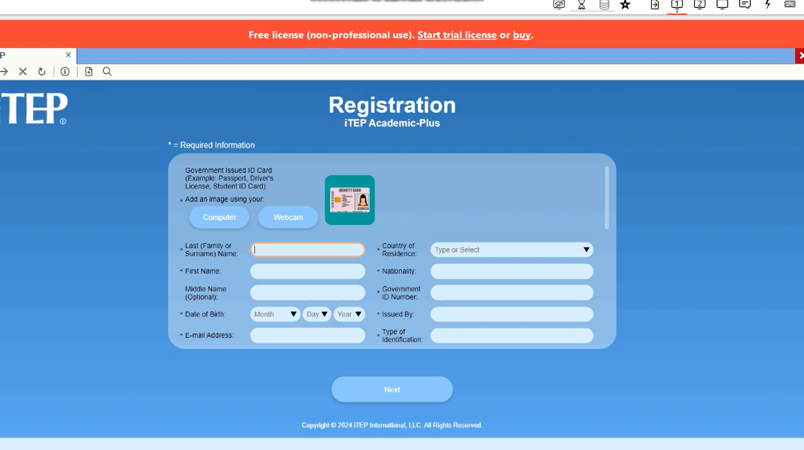

# Lockdown Browser Bypass Software  2024

## Overview

I have developed a software in 2024 to bypass lockdown browser which is used widely for online exams. 

This tool is perfect for using other applications, **such as Chrome**, while running LockDown Browser and for those who require remote assistance through platforms like **Anydesk, RemotePC, TeamViewer and Microsoft Teams**.

## Key Features

* **Remote Assistance Possibility**: Use Anydesk, Microsoft Teams, Remote Desktop, and TeamViewer seamlessly with LockDown Browser.

* **Window Switching**: Easily switch between windows using Alt+Tab without any notification with LockDown Browser.

* **Custom Solutions**: Need a specialized bypass for a specific exam browser? I can develop custom software to meet your exact needs.

  
For more information or to request a custom solution, feel free to reach out to me.

Thank you!

## Contract

[@bypassy](https://t.me/bypassy)

discord: bypassy

live:.cid.258b728263fb7085

## Demo

